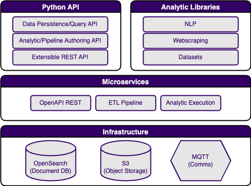

# Concepts

YAADA is a cloud-based data architecture and analytics platform designed to support the full analytics development spectrum, from prototyping to deployment-at-scale. YAADA’s primary focus is ingesting, storing, analyzing, and producing semi-structured document-oriented data.

## YAADA Architecture

<figure markdown>
  { width="600" }
  <figcaption>YAADA Architecture</figcaption>
</figure>

YAADA is a framework for handling and analyzing data. YAADA utilizes two data stores — Elasticsearch and S3 object storage — to provide services that allow for analysis and processing of data through Python-based analytics.

YAADA uses a containerized approach through Docker. A standard YAADA project will have the following Docker containers:

| Container     | Function                                                                    |
| ------------- | --------------------------------------------------------------------------- |
| ingest        | Handles asynchronous per-document processing at ingest time                 |
| sink          | Handles sending data asynchronously to Elasticsearch                        |
| worker        | Handles asynchronous execution of analytics                                 |
| openapi       | OpenAPI-based REST API                                                      |
| elasticsearch | 3rd Party primary data store                                                |
| kibana        | 3rd Party data exploration/dashboard app provided by Elastic                |
| mosquitto     | 3rd Party MQTT messaging for communication between YAADA components         |
| zenko         | 3rd Party S3 style object storage for models and file data                  |
| tika*         | Optional 3rd Party service to parse text from a range of file types         |
| jupyter*      | Optional 3rd Party jupyter lab frontend for testing and running python code |

## Elasticsearch and Documents and Data Ingest

Elasticsearch is the main database used to store and retrieve data in YAADA. Data in Elasticsearch is stored in documents, and can be queried using the [Elasticsearch Query DSL](https://www.elastic.co/guide/en/elasticsearch/reference/7.10/query-dsl.html), a query language based on JSON.

Elasticsearch documents are the primary form of data that YAADA analytics operate over. Documents are semi-structured, JSON-like objects comprised of key/value pairs. They are represented as Python dictionaries in memory and transmitted across services as json-serialized objects.

All YAADA documents will at a mimimum have two required attributes:

| Field Name   | Type   | Description                                                                                                                     |
| ------------ | ------ | ------------------------------------------------------------------------------------------------------------------------------- |
| `doc_type`   | String | The name of the type of document being represented. Used to determine the Elasticsearch index where the document will be stored.|
| `id`         | String | The unique (within doc_type) id for the document. Used as Elasticsearch id. Autogenerated as a UUID if ommitted.                |
| `@timestamp` | String | ISO 8601 formatted time that the document was ingested into Elasticsearch. Will be autogenerated.                               |

The format of a minimal YAADA document in python would look like this:

```json
{
  "doc_type":"Foo",
  "id":"1",
  "foo":"bar"
}
```

With a default configuration, this document would be stored in the `yaada-{TENANT}-document-foo` index with an Elasticsearch unique id of “1”.

### Schemas
YAADA supports defining document schemas as json or yaml files following the [OpenAPI 3.0 json-schema variant](https://spec.openapis.org/oas/v3.0.0.html#schema-object).

## Analytics

A YAADA Analytic in it’s most general form is a parameterized function that takes in `0-n` documents and produces `0-m` documents.

Some common Analytics types are:

- acquire data – analytics that produce documents representing some external content such as news articles or data housed in an external API.
- transform data – analytics that take in a set of documents and emit updated versions of those documents (think Map from Map/Reduce).
- aggregate data – analytics that take in a set of documents, perform an analysis and produce a new document representing the aggregate analysis (think Reduce from Map/Reduce).

Generally, most analytics will follow the data flow pattern shown here:

<figure markdown>
  { width="600" }
  <figcaption>The typical flow of document data in an analytic</figcaption>
</figure>

### Analytic Context
YAADA provides a built-in `yaada.core.analytic.context.AnalyticContext` class that serves as the main API for interacting with or analyzing data. Most YAADA services will construct a single `context` object which will get used by any analytics or pipelines invoked to interact with the backend databases. A user can instantiated as a `context` object using the `yaada.core.analytic.context.make_analytic_context` method. Once instantiated, the context object provides a suite of methods for interacting with Elasticsearch, such as querying, fetching, and ingesting documents, as well as accessing YAADA capabilities like running analytics.


### Analytic Models
Some analytics may be able to produce results in a stateless manner through simple inspection of the incoming documents, but often an analytic will have to use some outside resources to produce results, such as a trained language model. YAADA analytics may define an optional analytic model building step, where the analytic builds a named model from a set of documents and writes it out to a file or set of files to be stored in object storage, as illiustrated here.

<figure markdown>
  { width="600" }
  <figcaption>Training and storing an analytic model based on documents</figcaption>
</figure>

Models created in this way can then be loaded from object storage and used by analytics to produce results, whether that be the analytic that created it or another analytic. This is generally done by querying documents, using the model to analyze those documents, and then ingesting the results back into Elasticsearch, as shown in the following diagram. When an analytic uses a model, all produced results will be annotated with the name of the analytic model they were produced by.

<figure markdown>
  { width="600" }
  <figcaption>Using a pretrained analytic model to analyze documents and produce new results</figcaption>
</figure>

## Pipeline Processors

Pipelines allow you to run a series of transform functions on documents of a specific `doc_type` each time such a document is ingested. Each pipeline correspond to one `doc_type`. If a pieline is configured for a `doc_type`, upon ingest documents of that type are run through the series of processors configured for that pipeline. A processor, similarly to a single-document analytic, takes in a document and modifies or adds new data to it before sending it off to the next step in the pipeline. If and when all the steps of a pipeline are complete, the document is then sent to be ingested into Elasticsearch.

<figure markdown>
  { width="600" }
  <figcaption>Ingested documents are run through a processing pipeline and then stored into Elasticsearch</figcaption>
</figure>