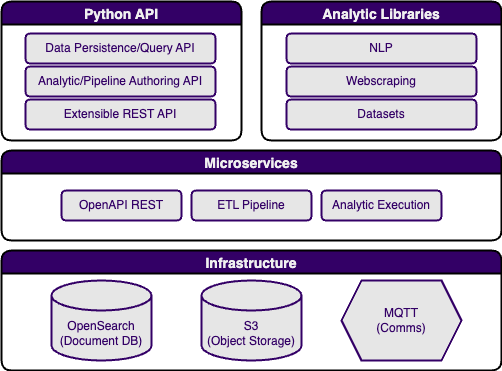

# Welcome to YAADA!

<figure markdown>
  { width="600" }
  <figcaption>YAADA Architecture</figcaption>
</figure>

YAADA is a data architecture and analytics platform developed to support the full analytics development lifecycle, from prototyping in local Python to operational deployment as containerized microservices. YAADA’s primary focus is ingesting, storing, and analyzing semi-structured document-oriented data and training, persisting, and applying analytic models. It leverages popular technologies such as OpenSearch and Kibana for document storage and visualization and Jupyter for exploratory data analysis and analytic prototyping. It handles all the details of data management, analytic serving through REST and message-based APIs, while providing an analytic plugin API that allows analytic developers to focus on the algorithms. In addition, YAADA includes pre-built analytic wrappers for popular open source libraries for NLP and web scraping.

